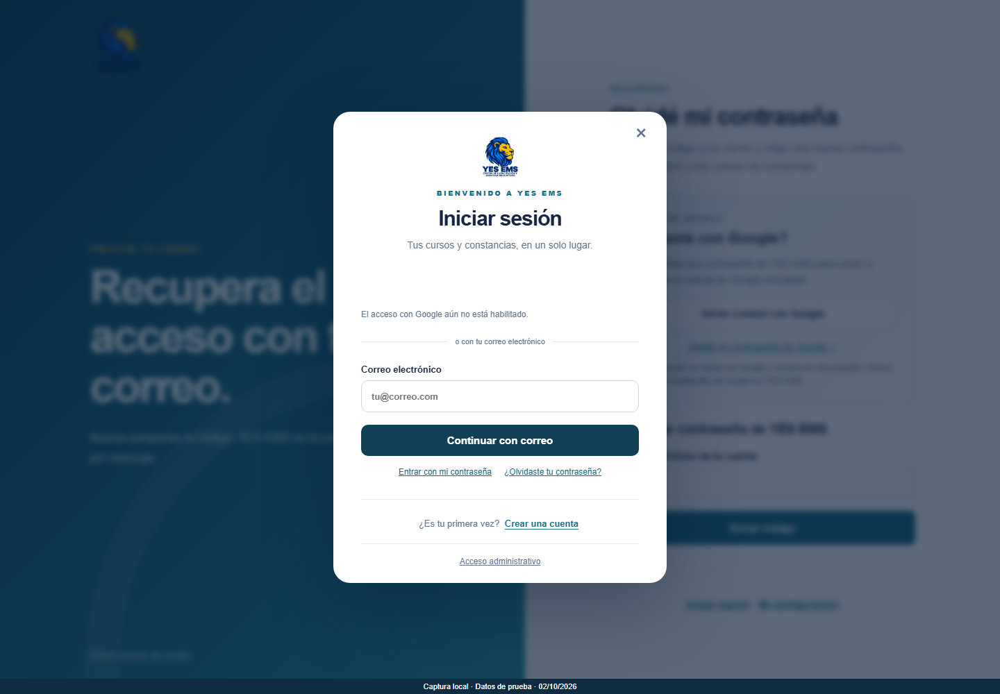
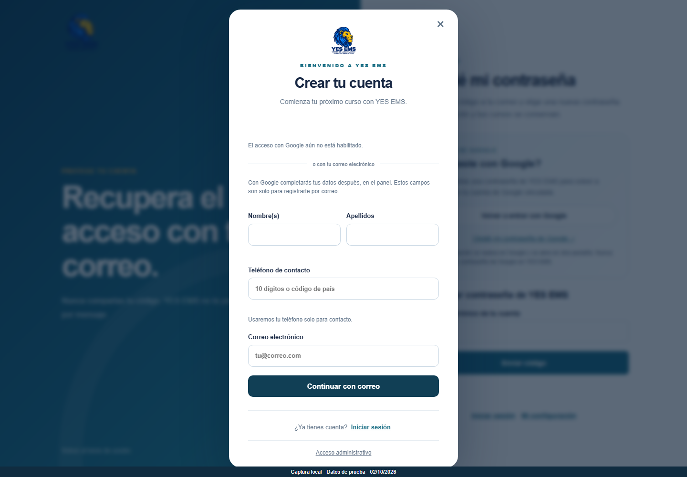
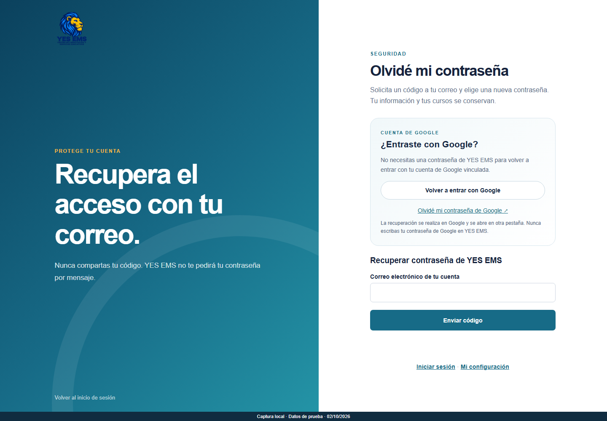
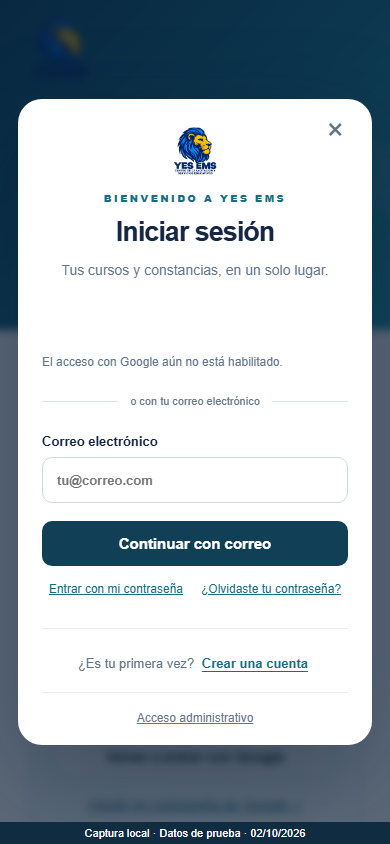
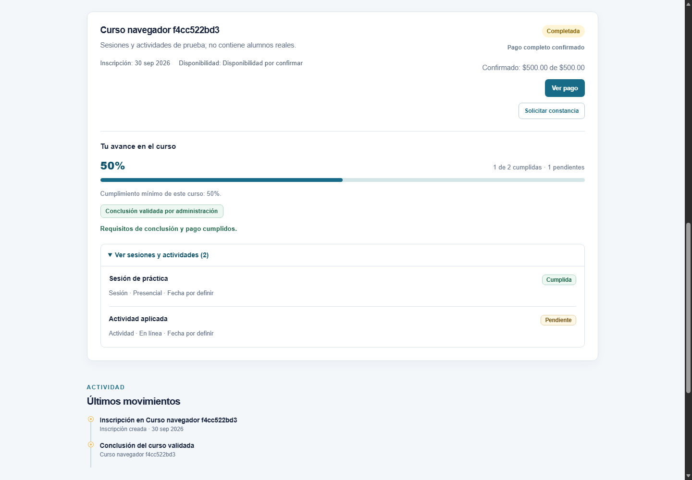

# Evidencias del jueves — 1 de octubre de 2026

## Reporte breve

Se trabajó en separar las opciones de **iniciar sesión** y **crear cuenta**, mejorar su presentación en dispositivos móviles y ofrecer rutas diferenciadas de recuperación para cuentas de Google y contraseñas de YES EMS. También se incorporaron controles de acceso verificado y recuperación segura.

Referencia del historial: commits `dfd17d6` y `561de2e`, fechados el 01/10/2026. Véanse [Acceso y recuperación](../ACCESO_UX.md) y [Acceso verificado](../ACCESO_VERIFICADO.md).

## Imágenes

| No. | Evidencia | Imagen |
| --- | --- | --- |
| 1 | Vista de inicio de sesión separada del registro | [Abrir captura](01-iniciar-sesion.png) |
| 2 | Vista para crear una cuenta | [Abrir captura](02-crear-cuenta.png) |
| 3 | Recuperación de contraseña de YES EMS y orientación para cuentas Google | [Abrir captura](03-recuperar-contrasena.png) |
| 4 | Adaptación del acceso a pantalla móvil | [Abrir captura](04-acceso-movil.png) |
| 5 | Cumplimiento de sesiones, avance real y requisitos para solicitar constancia | [Abrir captura](05-asistencia-progreso-constancias.png) |

## Alcance y fecha de las capturas

Las primeras cuatro capturas fueron realizadas el **viernes 2 de octubre de 2026**, sobre la versión actual del frontend, para ilustrar las funciones trabajadas el jueves. No son capturas tomadas el jueves ni una reconstrucción exacta de aquella versión.

Se utilizó navegador local con respuestas API ficticias y conexiones externas bloqueadas. Google se muestra sin configurar en este entorno de evidencia; eso no describe su configuración en Render. El correo está simulado como disponible para mostrar la interfaz: no se solicitó ni envió ningún código y no se verificó una cuenta Google real.

No contienen contraseñas, tokens reales ni datos personales de alumnos. Estas imágenes evidencian la interfaz, no sustituyen pruebas de entrega de correo o autenticación externa.

## Evidencia adicional: asistencia, progreso y constancias

Captura original del **30 de septiembre de 2026**, copiada sin modificaciones a esta carpeta para facilitar su inclusión en el reporte. Proviene de una prueba local con PostgreSQL temporal y datos ficticios; no es una nueva ejecución del jueves.

Muestra una sesión cumplida de dos actividades (50 % de avance), pago completo confirmado, conclusión validada por administración y la opción **Solicitar constancia**. El mínimo del curso de prueba era 50 %, por eso puede concluir sin mostrar un 100 % inventado. Esta imagen muestra la disponibilidad de la solicitud, no un PDF ya emitido.

Para los resultados del recorrido completo de autorización y descarga de PDF, consultar el [registro original de pruebas](../evidencias/2026-09-30/README.md).
