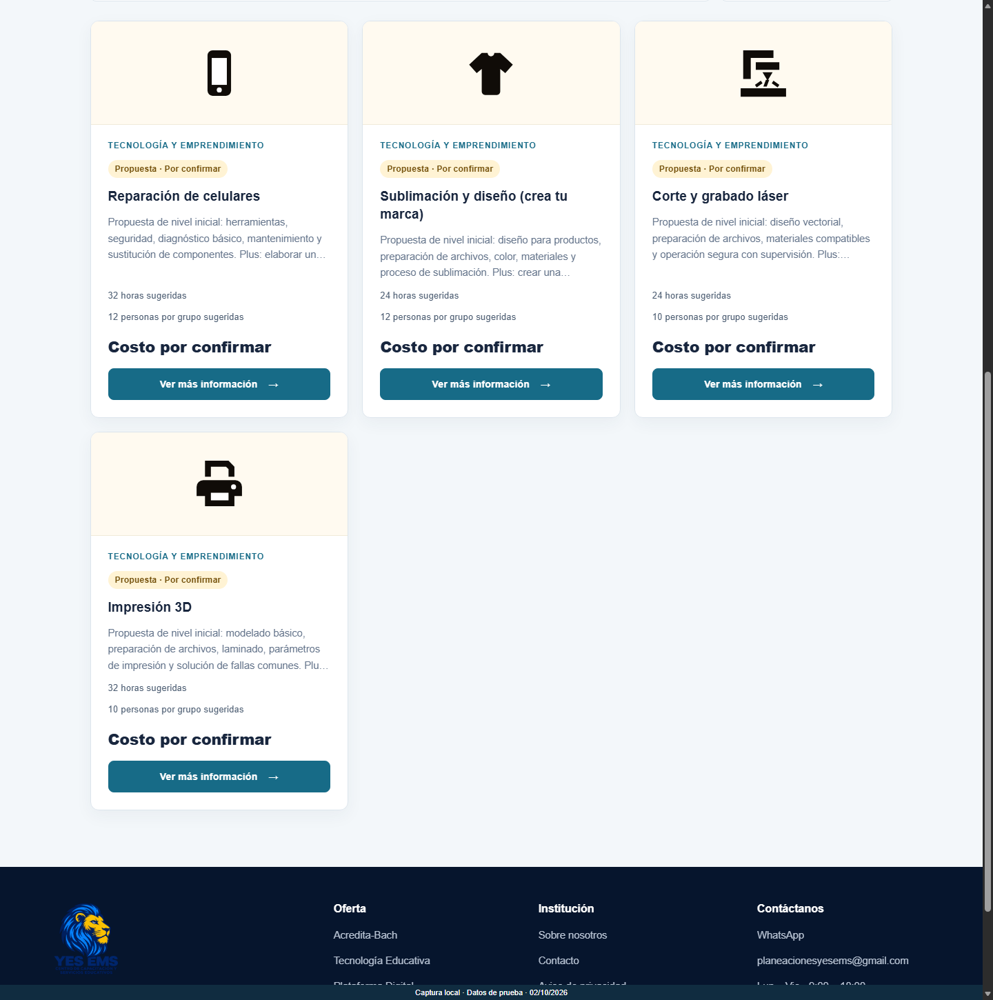
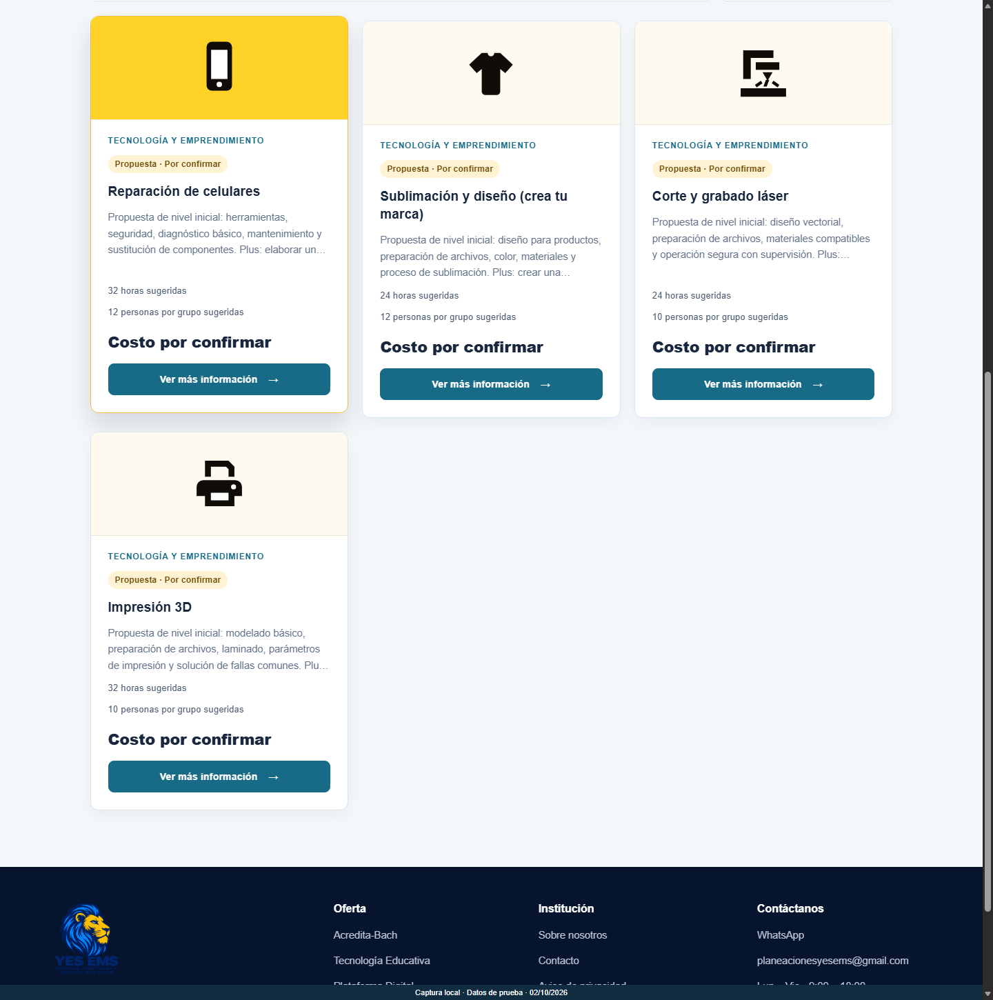
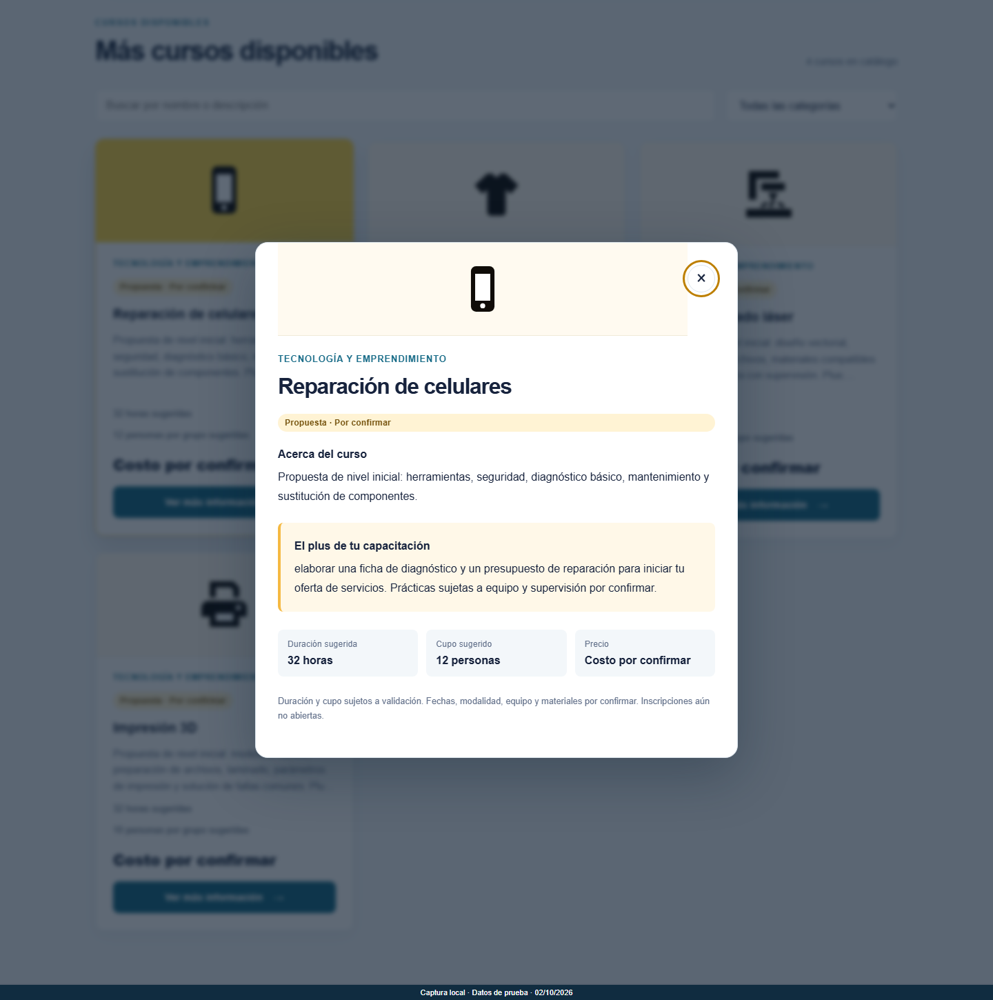
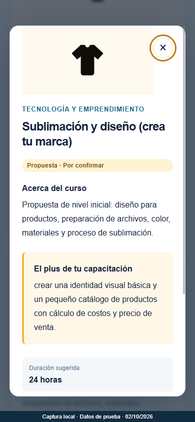
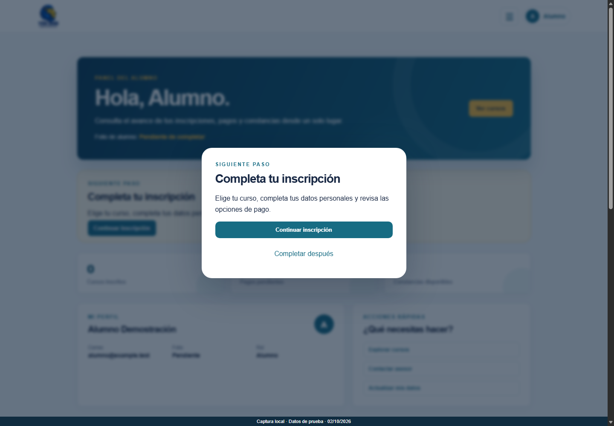
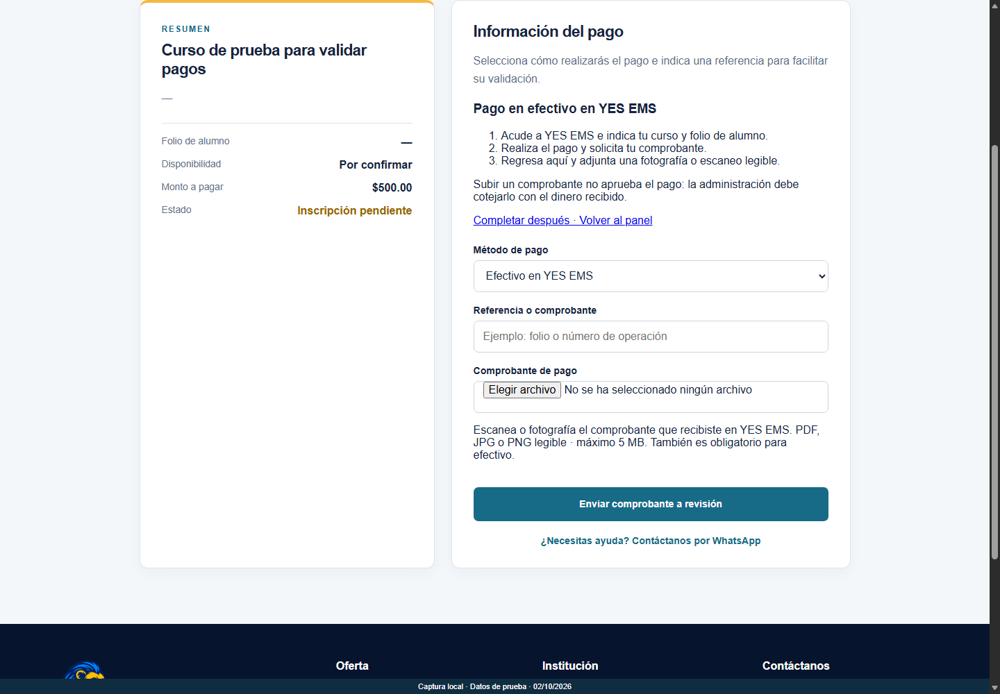

# Evidencias del viernes — 2 de octubre de 2026

## Reporte breve

Se incorporó el envío de códigos mediante Gmail API y el recorrido de inscripción con comprobante de pago en efectivo. Se agregaron cuatro propuestas de cursos —reparación de celulares, sublimación y diseño, corte y grabado láser e impresión 3D— con duración, cupo y un proyecto práctico sugeridos. Posteriormente se añadieron iconos, animación al pasar el cursor y una ventana de **Ver más información**. Introducción a Excel se retiró del catálogo mediante baja lógica, conservando su historial.

Referencias del historial: `d60a646`, `6754c16` y `a9032bd`, fechados el 02/10/2026. Véanse [Gmail API](../GMAIL_API.md), [Inscripción y efectivo](../INSCRIPCION_GOOGLE_EFECTIVO.md) y [Cursos propuestos](../CURSOS_PROPUESTOS.md).

## Imágenes

| No. | Evidencia | Imagen |
| --- | --- | --- |
| 1 | Catálogo con los cuatro cursos e iconos, sin Excel | [Abrir captura](01-catalogo-cuatro-cursos.png) |
| 2 | Tarjeta elevada y cabecera amarilla al pasar el cursor | [Abrir captura](02-animacion-al-pasar-cursor.png) |
| 3 | Descripción completa, plus y datos del curso | [Abrir captura](03-detalle-curso.png) |
| 4 | Ventana de información en móvil | [Abrir captura](04-detalle-movil.png) |
| 5 | Aviso para completar la inscripción desde el panel | [Abrir captura](05-completar-inscripcion.png) |
| 6 | Pago en efectivo con carga obligatoria del comprobante | [Abrir captura](06-pago-efectivo-comprobante.png) |

## Alcance de las evidencias

Capturas del **2 de octubre de 2026** realizadas en navegador local con el frontend del sistema. El catálogo usa los textos de la migración 007; la sesión, inscripción y pago son ficticios. El importe de $500 de la pantalla de pago corresponde exclusivamente al escenario de prueba, no al precio de los cursos propuestos.

Las propuestas mantienen precio por confirmar e inscripciones cerradas. Las imágenes de panel y pago ilustran funciones independientes y no demuestran que sea posible pagar una propuesta sin validación administrativa.

En esta captura no se modificó producción, no se recibieron pagos, no se cargaron archivos a Cloudinary ni se enviaron correos. La integración Gmail API se documenta en código y pruebas; no se dispone aquí de una captura que demuestre recepción real en Gmail. Tampoco se eliminaron cuentas: esa limpieza sigue pendiente de acceso autorizado a la base de Render.

## Verificaciones previas registradas

- 122 pruebas unitarias y 18 de integración aprobadas durante la entrega de iconos y detalle.
- Navegador local: hover, detalle, cierre con Escape, foco, móvil y movimiento reducido comprobados.
- En la publicación de `a9032bd` se verificaron cinco archivos del frontend en Render y el catálogo público con cuatro propuestas y sin Excel.

Estos resultados provienen de las comprobaciones realizadas durante la entrega; la generación de estas capturas no vuelve a ejecutar toda la suite ni consulta Render.

## Reproducir las imágenes de ambas carpetas

Desde `yesems-sistema/backend`, ejecutar `node scripts/capture-doc-evidence.js`. Requiere Microsoft Edge local. El script no carga `.env` y bloquea conexiones externas; vuelve a generar únicamente los PNG enumerados en estas carpetas.
